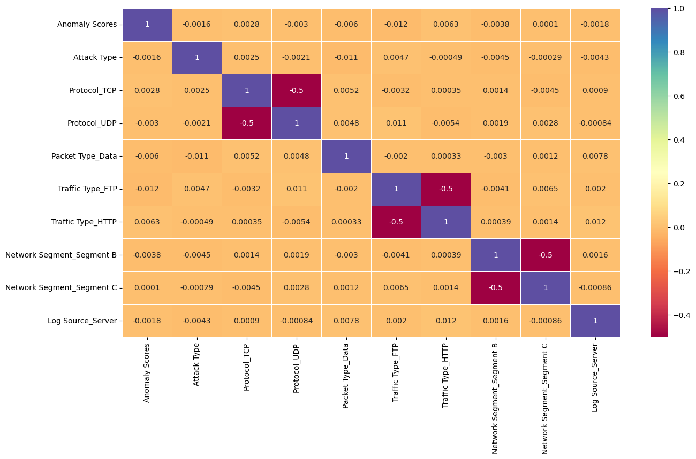

# Cybersecurity Attack Type Prediction: Learning from a Failed Dataset

## Overview

This project analyzes a synthetic cybersecurity dataset to predict attack types (DDoS, Malware, Intrusion) using machine learning. The model achieved ~33% accuracy on a 3-class problem—essentially random guessing. Rather than a failure of the model, this project reveals a fundamental lesson: **data quality determines ML success, not model complexity**.

**Note on process:** I used AI assistance for rephrasing sections of this README and the conclusions in the notebook, but all technical decisions, analysis, findings ideas are my own work.

**Dataset Source: https://github.com/incribo-inc/cybersecurity_attacks**

---

## Dataset Overview

**Source:** Public cybersecurity attack dataset  
**Size:** 40,000 rows, 25 initial features  
**Target:** Attack Type (3 classes: DDoS, Malware, Intrusion)

### Key Data Characteristics

- **Class Distribution:** Perfectly balanced (33.3% each class)
- **Feature Correlations:** ~0% correlation between features and target
- **Data Quality Issue:** Dataset appears synthetically generated or heavily preprocessed

---

## What Went Wrong (The Diagnosis)

### 1. Evenly Distributed Classes

The dataset had perfectly balanced classes across all three attack types. While balance _sounds_ good, this is actually a red flag in real-world security data. Real attack datasets are skewed—some attack types are rarer than others. Perfect balance suggests artificial data generation.

### 2. No Observable Correlations

I calculated feature-target correlations across all numeric features:

- Most correlations were near zero
- A few weak correlations (<0.15) existed, but nothing meaningful
- This means the features had no predictive signal for the target



### 3. Weak Model Performance

- **Logistic Regression:** 32.96% accuracy
- **Random Forest:** 33.00% accuracy
- **5-fold cross-validation baseline:** ~33% across all folds

All models performed at the random-guessing baseline, confirming that the dataset itself lacked signal, not that the models were poorly built.

---

## What I Learned

### 1. Data Quality > Model Complexity

Before this project, I thought better models would fix weak results. I learned the hard way: you can't train a good model on bad data. A simple model on quality data beats a complex model on garbage. This is critical for SOC work—analyzing real logs and alerts requires understanding your data _first_.

### 2. Feature Engineering Fundamentals

I applied multiple techniques during this project:

- **StandardScaler:** Normalized numeric features to mean=0, std=1 for algorithms sensitive to feature scaling
- **Label Encoding & One-Hot Encoding:** Converted categorical variables (Protocol, Traffic Type, Network Segment) into numeric format for ML
- **Correlation Analysis (Heatmap):** Visualized relationships between features and target to identify weak predictors

These are essential skills, but they can only improve results if the underlying data has signal.

### 3. Cross-Validation & Model Evaluation

I used 5-fold cross-validation to test model stability across data splits. This revealed the consistent ~33% performance, confirming it wasn't a one-time fluke or overfitting issue. The model performed equally poorly on every fold—another sign the problem is the data, not the model.

### 4. Real vs. Synthetic Data

This project taught me to question dataset assumptions. Red flags I now recognize:

- Perfect class balance (real data is skewed)
- Uniform temporal distributions (real attacks cluster at certain times)
- Zero or very weak feature correlations
- Artificially clean data with no outliers

---

## Technical Stack

- **Language:** Python 3
- **Libraries:** pandas, scikit-learn, matplotlib, seaborn, numpy
- **Techniques:**
  - Exploratory data analysis (EDA)
  - Feature scaling (StandardScaler)
  - Categorical encoding (Label/One-Hot)
  - Cross-validation (5-fold)
  - Classification models (Logistic Regression, Random Forest)

---

## Project Structure

```
cybersecurity-attack-prediction/
├── README.md                              (Project documentation)
├── requirements.txt                       (Python dependencies)
├── .gitignore                             (Git configuration)
│
├── data/
│   ├── cybersecurity_attacks.csv          (Raw dataset)
│   └── DATA_QUALITY_ISSUES.txt            (Data quality analysis)
│
├── images/
│   ├── 3_attacktype_distribution.png      (Class distribution chart)
│   └── correlation_heatmap.png            (Feature correlations)
│
└── notebooks/
    └── cybersecurity_analysis.ipynb       (Full analysis & modeling)
    
```
---

## What I Would Improve Next Time

### 1. Verify Dataset Reliability Before Starting

**Next approach:** Before investing time in feature engineering, I should:

- Check the data source and documentation
- Compare class distributions against real-world attack datasets (NSL-KDD, UNSW-NB15)
- Calculate feature-target correlations _before_ modeling
- Ask: "Does this data make sense for the problem?"

This could have saved time and prevented training models on a bad dataset.

### 2. Reduce Reliance on AI for Writing

I used AI to rephrase conclusions in this README, but relied too much on it for explanations. I should:

- Write my own analysis and interpretations
- Only use AI for grammar/clarity, not for generating conclusions
- Document findings in my own words first

This matters for interviews and in SOC work—you need to understand and explain your findings.

### 3. Improve Data Visualization Skills

My graphs are functional but basic:

- Heatmaps are standard grid layouts
- Distributions are simple histograms
- No custom styling or multi-panel layouts
- Limited insight from visuals alone

**Next time:** I'll focus on:

- Creating multi-panel figures that tell a story
- Using color more intentionally to highlight key findings
- Adding annotations to highlight patterns
- Learning seaborn aesthetics for polish

Real security dashboards have sophisticated visualizations—I should practice building them.

### 4. Write Cleaner Code & Better Documentation

- Grammar errors in variable names and comments
- Inconsistent code style (mixing camelCase and snake_case)
- Sparse inline comments explaining _why_ decisions were made
- No docstrings on functions

---

## Key Takeaway

This project succeeded by failing. I spent time on proper ML methodology (scaling, encoding, cross-validation, model comparison) but discovered the real lesson: **methodology only matters if your data has signal**.

[View Cybersecurity Analysis Notebook](https://nbviewer.org/github/quangminh206lnh-collab/YOUR_REPO/blob/main/notebooks/cybersecurity_analysis.ipynb)

---

## Repository

- **Notebook:** `cybersecurity_analysis.ipynb` contains the full analysis
- **Code:** Python, pandas, scikit-learn, matplotlib, seaborn
- **Lessons:** See "What I Learned" and "What I Would Improve" sections above
